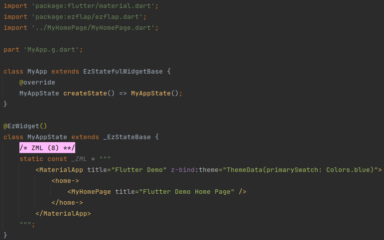
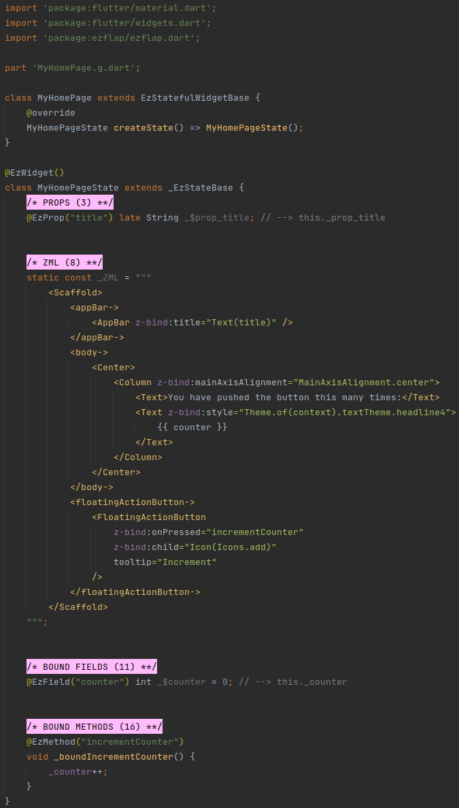

ezFlap is a reactive markup library for Flutter.

With ezFlap, you can:

* Use XML to define your user interface.
* Style widgets with CSS-like selectors.
* Control the rendering flow with XML attributes.
* Forget about `setState()`.
	* The UI updates automatically when the underlying data is modified.
* Easily communicate with parent widgets, using:
	* Events.
	* Bi-directional models.
* Easy access to hosted widgets from their parent widgets' code.
* Separate business logic from widget tree building.
* Easier conversion of Vuejs and Angular web applications to Flutter.

ezFlap is inspired by [Vuejs](https://vuejs.org/) and a little bit by [Angular](https://angular.io/).

Read the full documentation at [https://www.ezflap.io/docs](https://www.ezflap.io/docs).

## What ezFlap Looks Like
This is what an ezFlap version of the Flutter bootstrap project may look like:

### MyApp

### MyHomePage

## Getting Started
ezFlap is mainly a build-time tool, used to "compile" ezFlap widgets to Dart.

An "ezFlap widget" is a Flutter widget that provides its render tree using ezFlap's ZML and annotations.

When developing ezFlap widgets - we do not write a `build()` method. ezFlap generates it for us automatically.

We will refer to Flutter widgets that are not ezFlap widgets as "native widgets".

ezFlap analyzes:
 * The ezFlap widget class.
 * ezFlap annotations.
 * ZML code (that provides the build tree).
 * ZSS code (that provides styling).
 * ZSS files in the directory hierarchy.

Then, it generates the Dart code that will:
 * Build the widgets tree
 * Perform additional logic expressed in the ZML and ZSS of the widget.

### Where to Go From Here
Follow the [Installation instructions](https://www.ezflap.io/install), and then read the full [documentation](https://www.ezflap.io/docs).

OR choose from the following resources:
 * [ezFlap pub.dev package](https://pub.dev/packages/ezflap)
 * [ezFlap Core Widgets pub.dev package](https://pub.dev/packages/ezflap_widgets)
 * [ezFlap Core Widgets GitHub repository](https://github.com/ozlao/ezflap_widgets)
 * [ezFlap Docs GitHub repository](https://github.com/ozlao/ezflap_docs)
 * [ezFlap Tests GitHub repository](https://github.com/ozlao/ezflap_tests) (for testing ezFlap itself)
